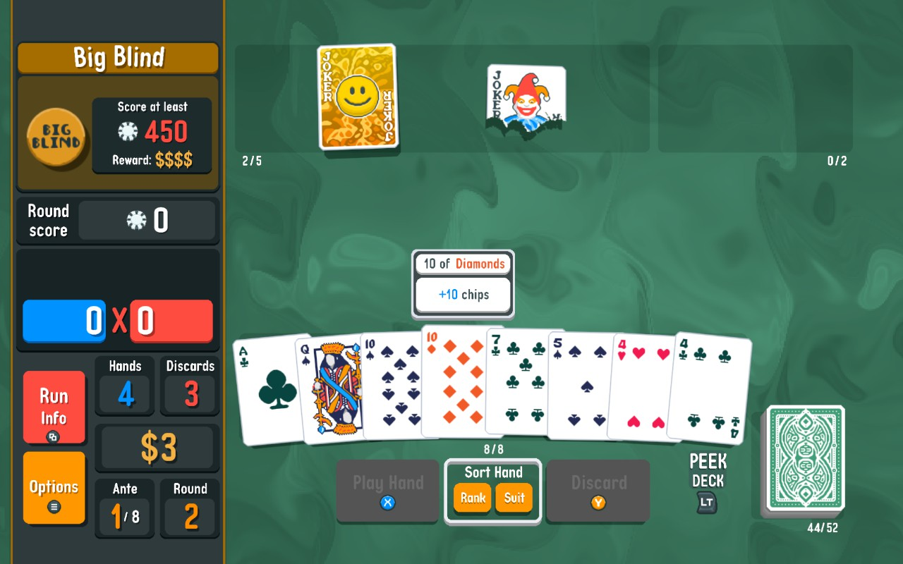
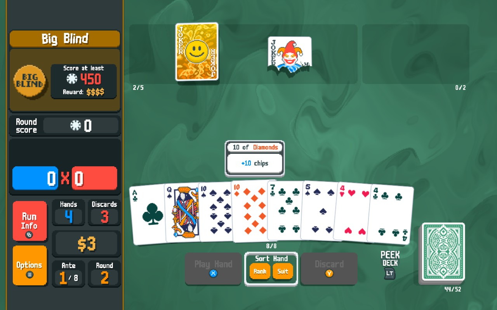

# Readabletro - Balatro readability mod

Original for comparison:

Improves readability, especially on the Steam Deck by:
* replacing the jagged pixel font with a similar smooth font TypoQuik-Bold
* increasing the font's size
* providing upscaled smooth graphics when "Pixel Art Smoothing" is enabled

## Installing the mod (Windows)

* download the [latest version](https://github.com/bladeSk/readabletro/releases/latest)
* unpack to `C:\Program Files (x86)\Steam\steamapps\common\Balatro` (or wherever your game is installed)
* run `apply_readabletro.cmd` - this will back up the original exe, unpack the game, update the files and repack the game

Only the version 1.0.0n-FULL is supported.

## Steam Deck

Copy the resulting exe to `/home/deck/.local/share/Steam/steamapps/common/Balatro` on your Steam Deck.

To make the game even smoother, you can enable native upscaling. Go to (cog icon) > Properties > General, set Game Resolution to 2560x1600 and enable "Set resolution for internal and external display".