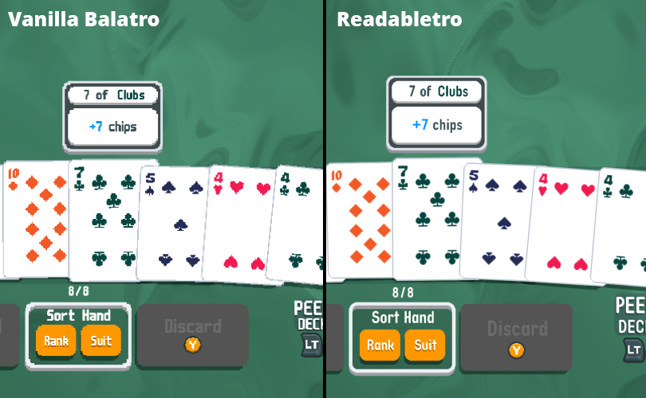

# Readabletro - Balatro readability mod

Improves readability, especially on the Steam Deck, by:
* replacing the jagged pixel font with a similar smooth font TypoQuik-Bold
* increasing the font's size
* providing smooth graphics upscaled using xBRZ 2x, when "Pixel Art Smoothing" is enabled

Supported versions: 1.0.1g-FULL, 1.0.1f-FULL, 1.0.0n-FULL

## Installing the mod (Windows)

* download the [latest version](https://github.com/bladeSk/readabletro/releases/latest)
* unpack to `C:\Program Files (x86)\Steam\steamapps\common\Balatro` (or wherever your game is installed)
* run `apply_readabletro.cmd` - this will back up the original exe, unpack the game, update the files and repack the game

## Installing the mod (Steam Deck/Linux)

* switch to desktop mode
* download the [latest version](https://github.com/bladeSk/readabletro/releases/latest)
* unpack to `/home/deck/.local/share/Steam/steamapps/common/Balatro`
* right click `apply_readabletro.sh` and select _Run in Konsole_ - this will back up the original exe, unpack the game, update the files and repack the game

Alternatively just copy the patched `exe` from your Windows machine to `/home/deck/.local/share/Steam/steamapps/common/Balatro`.

To make the game even smoother, you can enable native upscaling on Steam Deck. Go to (cog icon) > Properties > General, set Game Resolution to 2560x1600 and enable "Set resolution for internal and external display".
